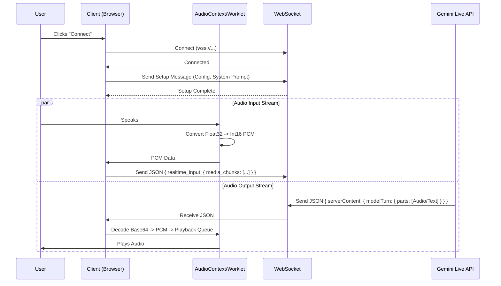

# Master Plan: Real-Time Audio Live Chatbot Implementation

This document outlines the architectural and technical "master plan" for implementing a real-time, bidirectional audio chatbot in any web application, utilizing the Gemini Multimodal Live API.

## 1. High-Level Architecture

The system relies on a direct WebSocket connection between the Client (Browser) and the AI Model (Gemini). This minimizes latency by bypassing intermediate backend servers for the audio stream itself.



## 2. Technical Requirements & Stack

*   **Frontend**: Modern JavaScript Framework (React, Vue, Svelte, or Vanilla JS).
*   **Audio API**: Web Audio API (`AudioContext`, `AudioWorklet`, `MediaStream`).
*   **Transport**: WebSocket (`WebSocket` API).
*   **AI Service**: Google Gemini Multimodal Live API.

## 3. The "Nitty Gritties": Implementation Details

### Phase 1: Audio Capture & Processing (Input)

The biggest challenge is converting browser audio (Float32) to the format Gemini expects (16kHz, 16-bit PCM Mono).

**1. Microphone Access:**
Use `navigator.mediaDevices.getUserMedia` with specific constraints for voice.
```javascript
const stream = await navigator.mediaDevices.getUserMedia({
    audio: {
        echoCancellation: true,
        noiseSuppression: true,
        autoGainControl: true,
        sampleRate: 16000, // Request 16kHz if possible
        channelCount: 1
    }
});
```

**2. Audio Context & Worklet:**
Browsers often run at 44.1kHz or 48kHz. You **must** ensure the audio sent to Gemini is 16kHz.
*   **Option A**: Create `AudioContext` with `sampleRate: 16000`. (Best supported in modern browsers).
*   **Option B**: Resample manually if the browser ignores the sample rate hint.

**3. PCM Conversion (The Worklet):**
You cannot process raw audio on the main thread without blocking the UI. Use an `AudioWorklet`.
*   **Input**: Float32Array (Values between -1.0 and 1.0).
*   **Output**: Int16Array (Values between -32768 and 32767).

**Code Snippet (AudioWorkletProcessor):**
```javascript
// public/audio-processor.js
class PCMProcessor extends AudioWorkletProcessor {
    process(inputs, outputs, parameters) {
        const input = inputs[0];
        if (input.length > 0) {
            const float32Tensor = input[0];
            const int16Array = new Int16Array(float32Tensor.length);
            for (let i = 0; i < float32Tensor.length; i++) {
                // Clamp to [-1, 1]
                const s = Math.max(-1, Math.min(1, float32Tensor[i]));
                // Convert to 16-bit PCM
                int16Array[i] = s < 0 ? s * 0x8000 : s * 0x7FFF;
            }
            this.port.postMessage(int16Array.buffer);
        }
        return true;
    }
}
registerProcessor("pcm-processor", PCMProcessor);
```

### Phase 2: WebSocket Transport

**1. Connection URL:**
```
wss://generativelanguage.googleapis.com/ws/google.ai.generativelanguage.v1alpha.GenerativeService.BidiGenerateContent?key=YOUR_API_KEY
```

**2. Handshake & Setup:**
Upon connection, send a "setup" message to configure the session.
```json
{
  "setup": {
    "model": "models/gemini-2.5-flash-native-audio-preview-12-2025",
    "generation_config": {
      "response_modalities": ["AUDIO"],
      "speech_config": {
        "voice_config": {
          "prebuilt_voice_config": { "voice_name": "Aoede" }
        }
      }
    },
    "system_instruction": {
      "parts": [{ "text": "You are a helpful assistant." }]
    }
  }
}
```

**3. Sending Audio:**
Wrap the PCM data (from the Worklet) in a JSON envelope.
```javascript
// Inside your main app logic, receiving data from Worklet
workletNode.port.onmessage = (event) => {
    const pcmBuffer = event.data;
    const b64Data = arrayBufferToBase64(pcmBuffer); // Helper function
    ws.send(JSON.stringify({
        realtime_input: {
            media_chunks: [{
                mime_type: "audio/pcm",
                data: b64Data
            }]
        }
    }));
};
```

### Phase 3: Audio Playback (Output)

Gemini sends back audio chunks as Base64 strings in JSON messages. You need to decode and play them smoothly.

**1. Receiving Data:**
Handle WebSocket messages. They might be `Blob` (binary) or `String`.
```javascript
ws.onmessage = async (event) => {
    let data = event.data;
    if (data instanceof Blob) {
        data = await data.text(); // Parse Blob to text
    }
    const response = JSON.parse(data);
    
    // Extract Audio
    const parts = response.serverContent?.modelTurn?.parts;
    if (parts) {
        parts.forEach(part => {
            if (part.inlineData && part.inlineData.mimeType.startsWith('audio/')) {
                playAudioChunk(part.inlineData.data);
            }
        });
    }
};
```

**2. Decoding & Playback Queue:**
You cannot just play chunks immediately or you'll hear gaps/clicks. You need a **scheduling system**.

*   **Decode**: Base64 -> Uint8Array -> Int16Array -> Float32Array (Normalize back to -1.0 to 1.0).
*   **Schedule**: Use `AudioContext.currentTime` to schedule chunks back-to-back.

**Robust Scheduling Logic:**
```javascript
let nextStartTime = 0;

function playAudioChunk(base64Audio) {
    // 1. Decode Base64 to Float32 PCM
    const float32Data = decodeBase64ToFloat32(base64Audio);
    
    // 2. Create Audio Buffer
    const buffer = audioContext.createBuffer(1, float32Data.length, 24000); // Gemini output is usually 24kHz
    buffer.getChannelData(0).set(float32Data);
    
    // 3. Schedule Playback
    const source = audioContext.createBufferSource();
    source.buffer = buffer;
    source.connect(audioContext.destination);
    
    const currentTime = audioContext.currentTime;
    
    // If we fell behind (silence), reset the clock
    if (nextStartTime < currentTime) {
        nextStartTime = currentTime + 0.05; // Add 50ms buffer
    }
    
    source.start(nextStartTime);
    nextStartTime += buffer.duration;
}
```

## 4. Critical "Gotchas" & Optimizations

1.  **Echo Cancellation is Mandatory**: Without `echoCancellation: true` in `getUserMedia`, the AI will hear itself and enter a feedback loop.
2.  **Sample Rate Mismatch**:
    *   Input: Must be 16kHz (or resampled to it).
    *   Output: Usually 24kHz. Ensure your `createBuffer` uses the correct rate (24000).
3.  **Int16 vs Float32**:
    *   Web Audio API uses Float32 (-1.0 to 1.0).
    *   Gemini API uses Int16 (-32768 to 32767).
    *   **Input**: Float32 -> Int16.
    *   **Output**: Int16 -> Float32.
4.  **VAD (Voice Activity Detection)**: The Gemini Live API handles turn-taking automatically (it will send an "interrupted" signal if you speak over it), but you can implement client-side VAD to stop sending data when silent to save bandwidth.
5.  **Connection State**: Handle WebSocket disconnects gracefully. The session is ephemeral; if the socket closes, context is lost.

## 5. Summary Checklist

- [ ] **Buffer Management**: Implement the "nextStartTime" logic to ensure smooth audio without jitter.

## 6. Deployment & Security (Vercel / Serverless)

Since Vercel Serverless Functions have execution timeouts (typically 10-60 seconds), you **cannot** proxy the WebSocket connection through your own backend. You must maintain a **Direct Client-Side Connection**.

### The "Referer" Issue
Browsers often do not send the `Referer` header during WebSocket handshakes for privacy reasons. This causes Google's "HTTP Referrer" API Key restriction to fail with `Error 1008`.

### Recommended Configuration for Vercel
To deploy securely without a proxy:

1.  **API Key Restrictions**:
    *   **Application Restrictions**: Set to **"None"** (do not use HTTP Referrers or IP addresses).
    *   **API Restrictions**: Select **"Restrict key"** and choose **ONLY** the **"Generative Language API"**. This limits the key's scope so it cannot be used for other Google Cloud services (like Maps or Compute Engine).

2.  **Quotas & Budget**:
    *   Set a **daily quota** in the Google Cloud Console to prevent unexpected usage spikes.
    *   Set up **billing alerts**.

3.  **Why this is acceptable**:
    *   Since the connection is client-side, the API key is visible in the browser's Network tab regardless of restrictions.
    *   Restricting the *scope* (what the key can do) is the primary defense mechanism for public keys.
